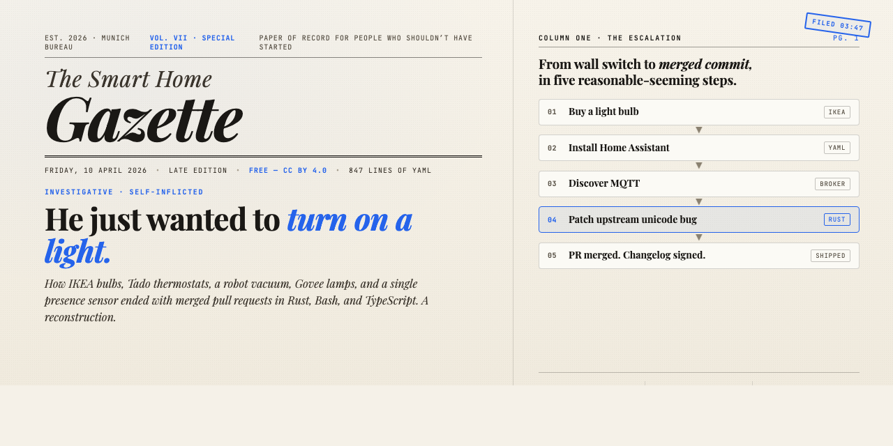

<p align="center">
  
</p>

<h1 align="center">The Smart Home Gazette</h1>

<p align="center">
  <strong>A newspaper about one man's descent into home automation.</strong><br />
  Vol. VII · Special Edition · Filed from Munich at 03:47 AM.
</p>

<p align="center">
  <a href="https://florianhorner.github.io/smart-home-gazette/"></a>
  <a href="https://florianhorner.github.io/smart-home-gazette/de.html"></a>
</p>

<p align="center">
  <a href="#whats-inside">What's inside</a> ·
  <a href="#read-it-locally">Read it locally</a> ·
  <a href="#the-evidence">The evidence</a> ·
  <a href="#corrections-and-letters">Corrections</a>
</p>

<p align="center">
  <a href="https://github.com/florianhorner/smart-home-gazette/commits/main"></a>
  <a href="https://github.com/florianhorner/smart-home-gazette/stargazers"></a>
  
  
</p>

---

## The story

**A man bought a smart light bulb. Several years later, his name is in a Rust changelog.**

This repository is the newspaper of record for that particular failure of judgment. Every detail actually happened. The IKEA bulbs happened. The Aqara FP2 happened. The 847-line `automation.yaml` happened. The golden epoxy-resin hand sculpture holding a Zigbee coordinator next to the coffee machine: that also happened, and there are witnesses.

It is written as a Late Edition broadsheet because that is how it felt while it was happening.

## What's inside

Five acts, one investigative reconstruction, a sidebar of diminishing sanity:

- **Act I — The Status Quo.** Six apps. Eight ecosystems. Technically fine.
- **Act II — The Catalyst.** One millimetre-wave presence sensor. €90 collapsed into a binary signal.
- **Act III — The Consolidation.** Home Assistant was supposed to end the tinkering. It did not end the tinkering.
- **Act IV — The Relocation.** 54 Zigbee devices, a congested 2.4 GHz band, and a decorative object with a radio antenna.
- **Act V — The Aftermath.** Pull requests in three languages the subject does not write. Merged anyway.

Also: a Sanity Index, a Glossary of Escalation, Reader Mail, and a Classifieds section where a €90 presence sensor is sold with a statistical warning about Home Assistant.

## Read it online

The paper lives on GitHub Pages, because a newspaper should be publicly accessible and because static HTML remains the only web technology that reliably works.

- **English edition** — [florianhorner.github.io/smart-home-gazette](https://florianhorner.github.io/smart-home-gazette/)
- **Deutsche Ausgabe** — [florianhorner.github.io/smart-home-gazette/de.html](https://florianhorner.github.io/smart-home-gazette/de.html)

## Read it locally

It is a handful of HTML files with inline CSS. Open any of them in a browser. That is it.

```bash
git clone https://github.com/florianhorner/smart-home-gazette.git
cd smart-home-gazette
open index.html     # macOS
# or: xdg-open index.html (Linux) / start index.html (Windows)
```

If you prefer to serve it properly — sticky header, theme toggle, the whole experience:

```bash
python3 -m http.server 8000
# then visit http://localhost:8000/
```

No build step. No `npm install`. No framework. This is on purpose.

## The evidence

Every open-source contribution referenced in Act V is real and linked:

| Project                                                              | Language     | What                                             | Status                                                                                                                                |
| -------------------------------------------------------------------- | ------------ | ------------------------------------------------ | ------------------------------------------------------------------------------------------------------------------------------------- |
| [govee2mqtt](https://github.com/wez/govee2mqtt)                      | Rust         | Unicode crash fix for Chinese preset names       | Merged                                                                                                                                |
| [addon-glances](https://github.com/hassio-addons/addon-glances)      | Bash, Docker | Deprecation fixes, 502 bug fix                   | [PR #603](https://github.com/hassio-addons/addon-glances/pull/603), [PR #604](https://github.com/hassio-addons/addon-glances/pull/604) |
| [addon-glances fork](https://github.com/florianhorner/addon-glances) | Bash, Docker | MQTT export, security hardening, Glances upgrade | Published                                                                                                                             |
| [Lightener](https://github.com/fredck/lightener)                     | TypeScript   | Visual brightness curve editor card              | In progress                                                                                                                           |

The pattern is not "I learned to code." The pattern is: **the barrier to contributing to open source is gone.**

## Files in this repository

- [`index.html`](index.html) — the English edition, five acts, full sidebar, Classifieds
- [`de.html`](de.html) — die deutsche Ausgabe
- [`cost-of-light-switch.html`](cost-of-light-switch.html) — itemised receipts for the light switch
- [`escalation-timeline.html`](escalation-timeline.html) — the timeline, plotted
- [`docs/banner.html`](docs/banner.html) — the masthead banner source (renders to `docs/banner.png`)

## Corrections and letters

The Gazette accepts corrections via [GitHub issues](https://github.com/florianhorner/smart-home-gazette/issues) and PRs via the usual mechanism. Editorial preferences:

- Factual corrections welcome. Dates, product names, technical claims.
- Tonal corrections less welcome. The deadpan is load-bearing.
- Typos: yes please.
- "Have you considered Matter?" — see Glossary of Escalation, entry `MATTER`.

## About the author

Written by **Florian Horner** — an AWS account executive, not an engineer. Built with [Claude Code](https://claude.ai/claude-code) as part of the Cross-Ecosystem Claude Sledgehammer Tour: a series documenting what happens when a non-engineer uses AI to contribute to real open-source projects.

His parents still don't understand. The maintainers do.

## License

Content: [CC BY 4.0](https://creativecommons.org/licenses/by/4.0/) — share it, quote it, translate it, print it on a broadsheet. Attribution appreciated.
